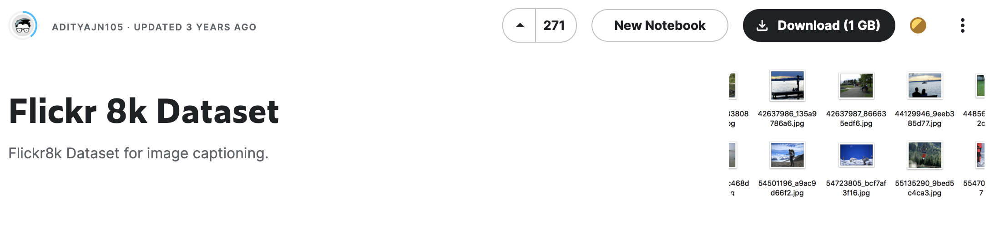
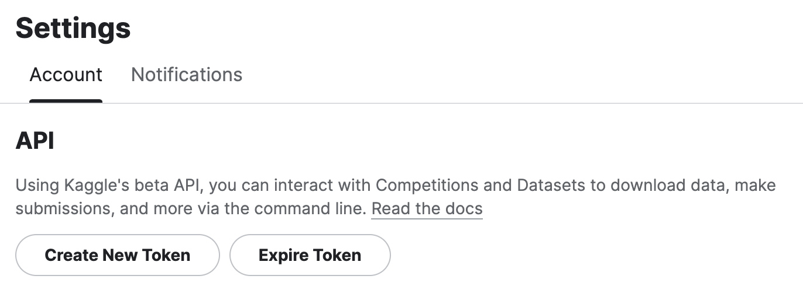
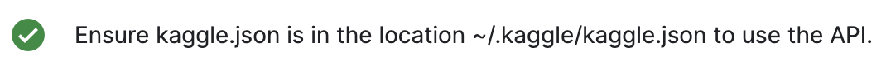

Image Captioning을 코드로 구현해보고 싶어서 [kaggle : Image Captioning With Attention - Pytorch][1]를 참조해 코드를 구현해보려했다.
그러나 데이터 다운받는 과정에서 잠시 애를 먹었다.

kaggle에서 [flickr8k][2] 데이터셋을 다운받으러 갔는데 내 노트북이 아니라 서버에서 작업하고 있어서 서버에 직접 다운받으려고 kaggle api로 활용해 다운받으려 했다.

kaggle api download code->
**kaggle datasets download -d adityajn105/flickr8k**

그런데 벌써 에러를 만났다...

에러명 ->
**OSError: Could not find kaggle.json. Make sure it's located in /home/-/.kaggle. Or use the environment method.**

---
해결방안

kaggle의 자신의 account setting에 들어가서 내리다보면 kaggle's beta API를 사용하려면 위의 token을 만들라는 이야기를 한다.

Create New Token을 사용해서 Token을 만들고 ~/.kaggle/kaggle.json 위치에 옮기면 된다.

---
경고->
**Warning: Your Kaggle API key is readable by other users on this system! To fix this, you can run 'chmod 600 ~ '**
api key 보안 경고가 나오니 chmod 명령어를 사용해서 보안설정을 해주는게 좋을 것 같긴 합니다 :)

[1]: https://www.kaggle.com/code/mdteach/image-captioning-with-attention-pytorch
[2]: https://www.kaggle.com/datasets/adityajn105/flickr8k